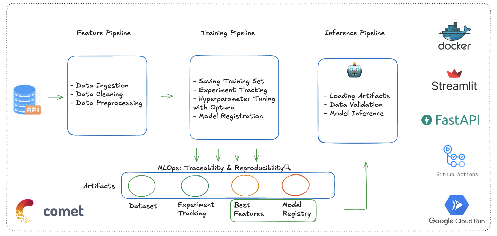
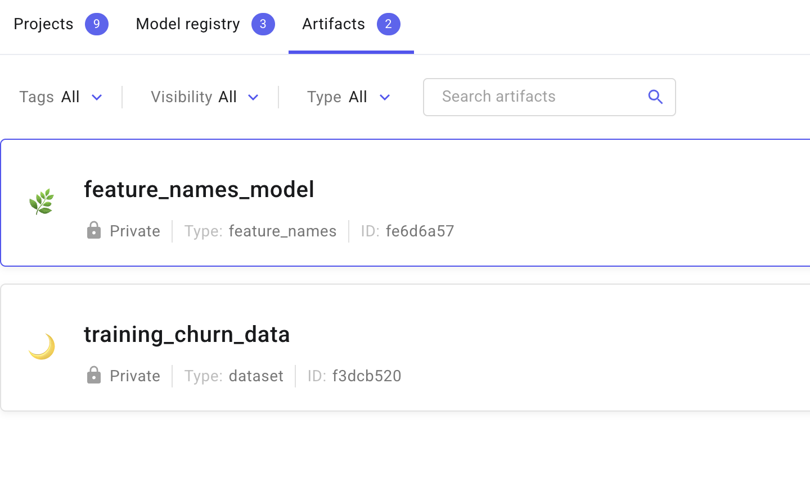
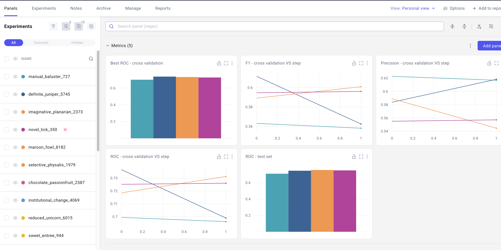
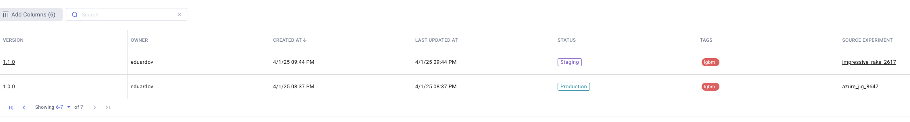
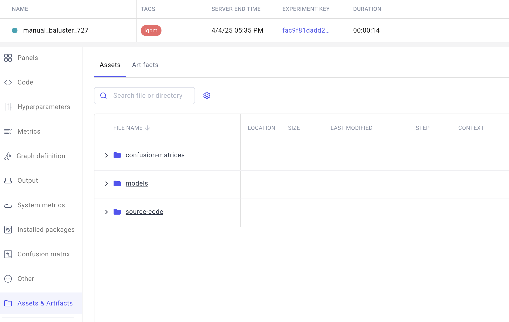
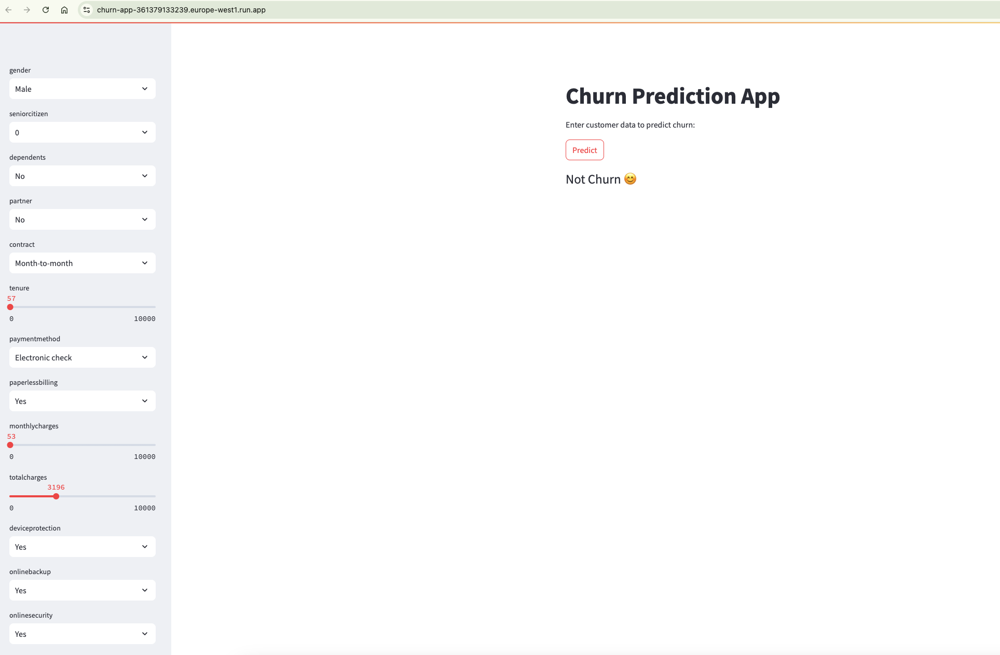

# Churn Prediction End-to-End Workflow 🤖

## Overview
This project implements a full end-to-end machine learning workflow for churn prediction. It follows a structured approach covering feature engineering, model training, and inference. The workflow integrates several tools and frameworks to ensure scalability, reproducibility, and efficient model deployment.

## Architecture


## Feature Pipeline
- Extracts **demographic data**, **subscription data**, and **customer data**.
- Performs **feature engineering** to enhance predictive power.

## Training Pipeline
- Logs the **training dataset** in **Comet ML** as an artifact.
- Performs **experiment tracking** in **Comet ML**.
- Implements **hyperparameter tuning** using **Optuna**.
- Saves **model performance metrics** in **Comet ML**.
- Registers the **features** selected by the best model.
- Registers the best model in **Comet ML's Model Registry**.


### Feature Artifacts in Comet ML


### Experiment Tracking in Comet ML


### Model Registry in Comet ML


### Model Details in Comet ML


## Inference Pipeline
- Retrieves the best model from **Comet ML's Model Registry**.
- Loads the corresponding **feature artifact** to ensure consistency.
- Deploys a **FastAPI service** for serving predictions.

## Frontend Application
- A **Streamlit app** for better visualization of results.
- Users can enter customer data and receive a churn prediction.
- Deployed on **Google Cloud Run** for scalability.

### Streamlit App on Cloud Run


## Deployment & CI/CD
- Uses **Docker** and **Docker Compose** for local development and testing.
- Stores container images in **GCP Artifact Registry**.
- Uses **Secret Manager** to securely manage credentials.
- Implements a **CI/CD pipeline** for automated deployment.
- **Pre-commit hooks** ensure linting and formatting.
- **uv** is used as a package manager for efficient dependency management.

## Setup & Usage
1. Clone the repository:
   ```bash
   git clone https://github.com/Eduardovasquezn/churn-prediction.git
   cd churn-prediction
   ```
2. Set up virtual environment and dependencies:
   ```bash
   uv venv --python 3.13
   source .venv/bin/activate
   uv sync
   ```
3. Set Up Environment Variables. Copy .env.example to .env and update the necessary values:
   ```bash
    cp .env.example .env
   ```
4. Setup the python path as the root:
   ```bash
    export PYTHONPATH=$(pwd)
   ```
5. Run the Feature-Training-Inference pipeline:
   ```bash
   sh run_pipeline.sh
   ```

6. Run the Streamlit frontend:
   ```bash
   streamlit run src/frontend/app.py
   ```

## Support & Contributions

If you found this project useful or interesting, consider giving it a ⭐ on GitHub! It helps others discover it and keeps me motivated to improve and add new features.

Feel free to open issues, suggest improvements, or contribute to the project. Any feedback is appreciated!
